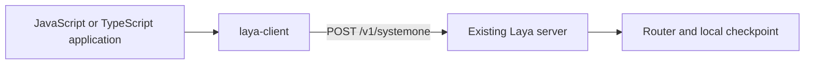

# TypeScript SDK design

`laya-client` is a dependency-free HTTP client for a self-hosted `laya-serve`
server. It uses the `POST /v1/systemone` endpoint and adds no Python production
code or server dependencies.
The npm package starts at version `0.1.0`, independently of Python releases.

## Boundaries

| Component | Responsibility |
| --- | --- |
| `sdk/typescript` | Question/answer types, presets, validation, native fetch, errors and cancellation |
| `laya/serve.py` | Existing HTTP endpoint, Bearer authentication, health and request limits |
| `laya/router.py` | Checkpoint selection, loading and inference routing |
| `laya/agent.py` | Tokenization, PyTorch inference and calibrated answer formatting |
| `laya/presets.py` | Source for the five generated TypeScript question presets |

The SDK exports `predict` and a Laya-only `health` probe. It ships ESM,
CommonJS and declarations, retaining inferred question IDs and choice labels.
Use `laya-client` when a JavaScript or TypeScript application talks over HTTP to
self-hosted Python `laya-serve`. Use `laya-ts` when inference must run directly
inside JavaScript through its local ONNX runtime, without a Python server.

## Shared contract

Requests contain `state` and `questions`. Unless configured or supplied for a
prediction, `laya-client` omits `model`, letting `laya-serve` select a local
checkpoint automatically. A client-wide or per-call `model` can select a local
checkpoint. Choice label arrays are normalized to maps with null descriptions
before transport.

Responses preserve `model`, `answers`, and token `usage`. Laya's `routing` and
answer `action` fields are optional extensions; Noul confidence is optional too.
Choice and Score confidence, distributions, and Score legends remain required.
Optional extensions are validated when present.

`/v1/systemone` does not expose Python's standalone routing method or `task` and
`lang` overrides. The SDK rejects those legacy options instead of silently
ignoring them. Laya's public `/health` returns `status`, `loaded`, and `device`.
Prediction never probes health first.

FastAPI detail strings and validation arrays are preserved as `LayaAPIError`
messages/details. Structured error envelopes from compatible backends are also
accepted. Requests have configurable deadlines and caller cancellation, and
are never retried automatically.

## Verification and release

Unit tests cover request construction, all answer shapes, Laya extensions,
FastAPI errors, JSON validation, deadlines and cancellation.
Type checks cover optional metadata, rejected legacy methods/options, inferred
answer types, and ESM/CommonJS consumers. The live integration test starts the
unchanged `laya.serve` application with a tiny offline checkpoint, compares SDK
predictions against direct Python inference, and exercises routing, presets,
authentication and request limits. CI runs the SDK checks on Node.js 22 and 24.

Tiny random weights verify transport and numerical parity, not pretrained
quality or performance.

See the [SDK guide](../sdk/typescript/README.md) for setup, examples, and npm
publishing. The package will be published under the `laya-client` name. Python release workflows
are unchanged.
