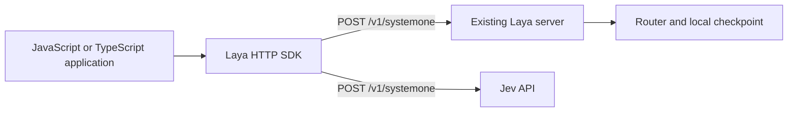

# TypeScript HTTP SDK design

`@laya/typescript-sdk` is a dependency-free HTTP client for the existing
`laya.serve` server. It uses the Jev-compatible `POST /v1/systemone` endpoint
introduced in #31; it adds no Python production code or server dependencies.
The npm package starts at version `0.1.0`, independently of Python releases.

## Boundaries

| Component | Responsibility |
| --- | --- |
| `sdk/typescript` | Question/answer types, presets, validation, native fetch, errors and cancellation |
| `laya/serve.py` | Existing HTTP endpoint, Bearer authentication, health and request limits |
| `laya/router.py` | Checkpoint selection, loading and inference routing |
| `laya/agent.py` | Tokenization, PyTorch inference and calibrated answer formatting |
| `laya/presets.py` | Source for the five generated TypeScript question presets |

The SDK exports `predict` and a Laya-only `health` probe. It ships ESM,
CommonJS and declarations, retaining inferred question IDs and choice labels.
The separate `laya-ts` package runs local ONNX inference; this HTTP client has
no JavaScript model runtime dependency.

## Shared contract

Requests contain `state`, `questions`, and `model`. The default `jev-latest`
selects Jev's default model when calling TypeSafe and automatic routing when
calling Laya, whose server ignores unrecognized model IDs. A client-wide or
per-call `model` can select a Laya checkpoint or a different Jev model. Choice
label arrays are normalized to maps with null descriptions before transport.

Responses preserve `model`, `answers`, and token `usage`. Laya's `routing` and
answer `action` fields are optional extensions; Noul confidence is optional too.
Choice and Score confidence, distributions, and Score legends remain required.
Optional extensions are validated when present. See the
[official Jev API contract](https://docs.typesafe.ai/api).

`/v1/systemone` does not expose Python's standalone routing method or `task` and
`lang` overrides. The SDK rejects those legacy options instead of silently
ignoring them. Laya's public `/health` returns `status`, `loaded`, and `device`;
it is not part of the shared Jev protocol. Prediction never probes health first.

FastAPI detail strings and validation arrays are preserved as `LayaAPIError`
messages/details. Structured error envelopes from compatible backends are also
accepted. Requests have configurable deadlines and caller cancellation, and
are never retried automatically.

## Verification and release

Unit tests cover the shared request contract, all three Jev answer shapes,
Laya extensions, FastAPI errors, JSON validation, deadlines and cancellation.
Type checks cover optional metadata, rejected legacy methods/options, inferred
answer types, and ESM/CommonJS consumers. The live integration test starts the
unchanged `laya.serve` application with a tiny offline checkpoint, compares SDK
predictions against direct Python inference, and exercises routing, presets,
authentication and request limits. CI runs the SDK checks on Node.js 22 and 24.

Jev compatibility is checked against documented contract fixtures; no hosted
Jev request is made by the test suite. Tiny random weights verify transport and
numerical parity, not pretrained quality or performance.

See the [SDK guide](../sdk/typescript/README.md) for setup, examples, and npm
publishing. The package is configured for public `@laya/typescript-sdk` releases
but publishing requires access to that npm scope. Python release workflows are
unchanged.
