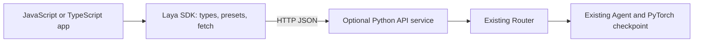

# Repository analysis and TypeScript SDK design

The existing project is a Python inference library, not an HTTP service. Its
public package version is 0.3.6. The npm client starts at version 0.1.0 with an
independent package version and a `/v1` HTTP contract.

## Existing boundaries

| Module | Responsibility | SDK treatment |
| --- | --- | --- |
| `laya/agent.py` | Download checkpoints, tokenize, run PyTorch, calibrate and format answers | Keep on the Python server |
| `laya/common.py` | Custom decision head, sequence construction, training/calibration helpers | Keep on the Python server |
| `laya/router.py` | Choose checkpoint, lazy loading, preloading, LRU memory management | Expose routing and prediction over HTTP |
| `laya/lang.py` | Script and language heuristics | Reuse the server's implementation |
| `laya/presets.py` | Five ready-made question schemas | Generate TypeScript equivalents from Python |
| `laya/email.py` | Email parsing and cleanup | Python-only in this initial SDK |
| `laya/shortlist.py` | Embedding-based candidate selection | Python-only; caller-supplied functions cannot be sent over JSON |

The high-value contract is `Router.predict(state, questions)`. It handles three
discriminated question types: choice labels with distributions, ordinal scores
with legends/distributions, and `noul` boolean probabilities. Answers also carry
confidence, action probability, token usage and routing metadata. All of these
are preserved by the TypeScript client.

## Architecture chosen

The Python service is an optional `server` extra; normal Python users do not gain
web framework dependencies. The JavaScript package has no runtime dependencies,
uses native fetch, and ships ESM, CommonJS and matching declaration files. Its
public methods are `predict`, `route`, and `health`.

This boundary preserves model behavior without duplicating tokenization,
temperature calibration, language heuristics or device fallback. The inspected
repository has no ONNX artifacts/exporter or JavaScript model runtime. Native
JavaScript inference would be a separate project: export the complete custom
head and encoder, reproduce sequence/tokenizer behavior, validate numerical
parity, then benchmark each checkpoint and target runtime. An HTTP client does
not establish that native inference works.

The adapter validates JSON and question structure, returns consistent errors,
supports optional Bearer auth and explicit CORS origins, and serializes model
execution to account for mutable GPU fallback state. A tuple-valued repository
identifier in the router's opt-in workflow branch is normalized to a string at
the HTTP boundary. Existing Python model code is unchanged.

## Verification and remaining release work

Tests cover inferred question/answer types, ESM and CommonJS imports, JSON
validation, errors, cancellation, deadlines, authentication, routing and preset
consistency. The offline integration test starts a real service, loads a tiny
random checkpoint through `Agent`, and compares SDK output with direct Python
inference. Pretrained accuracy and GPU performance remain covered by the
existing model benchmarks, not the SDK tests.

The npm package is `@laya/typescript-sdk`, initially version `0.1.0`, with public
access on `registry.npmjs.org`. Publishing requires an authenticated npm account
with access to the `@laya` scope. SDK versions are independent of Python releases;
the existing `v*` tag workflow still releases only the Python package. See the
[SDK publishing guide](../sdk/typescript/README.md#publishing) for checks,
authentication, release commands, and installation.
